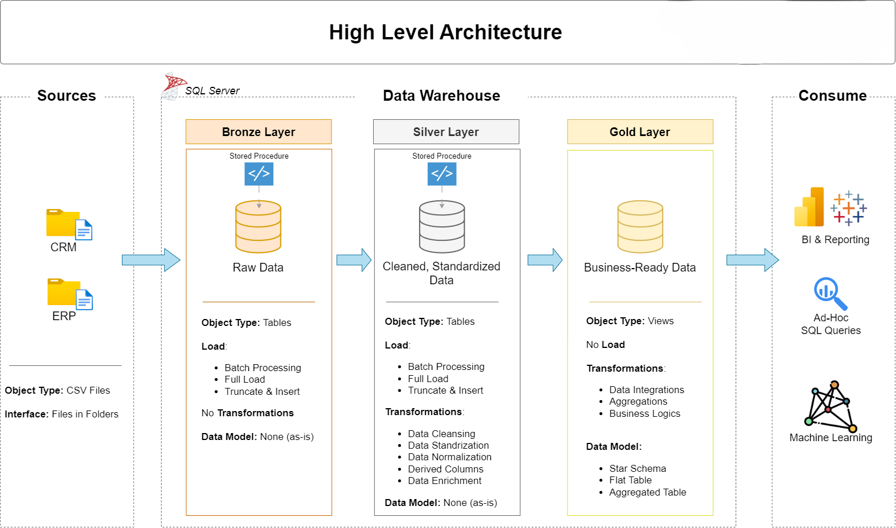

# Data Warehouse and Analytics Project

Welcome to the **Data Warehouse and Analytics Project** repository! 🚀  
This project showcases a complete data warehousing and analytics solution — from setting up the data warehouse to delivering valuable insights. Created as a portfolio project, it follows industry best practices in data engineering and analytics.

---

## 🏗️ Data Architecture

Designed and implemented a modern data architecture using the **Medallion Architecture** framework, which includes **Bronze**, **Silver**, and **Gold** data layers:  

* **Bronze Layer**: Ingested raw data from source systems (CSV files) into a **SQL Server** database for initial storage.
* **Silver Layer**: Performed data cleaning, standardization, and normalization to prepare data for analysis.
* **Gold Layer**: Developed **business-ready** datasets using a **star schema** design for reporting and analytics.

---

## 📖 Project Overview

End-to-end development of a **data warehousing and analytics solution**, including:

* **Data Architecture**: Built a scalable data warehouse using the Medallion Architecture model.
* **ETL Pipelines**: Designed and implemented **ETL processes** for data extraction, transformation, and loading from source files into the warehouse.
* **Data Modeling**: Created **fact and dimension tables** optimized for performance and analytical queries.
* **Analytics and Reporting**: Developed **SQL-based reports** and **dashboards** to provide actionable business insights.

---

### ✅ Skills Demonstrated

This project highlights practical experience and skills in:

* **SQL Development**
* **Data Architecture**
* **ETL Pipeline Development**
* **Data Engineering**
* **Data Modeling**
* **Data Analytics**

---
